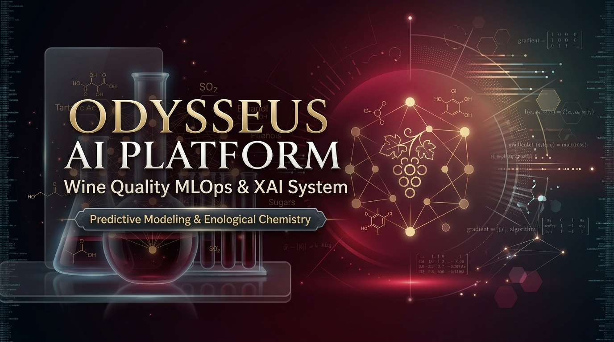
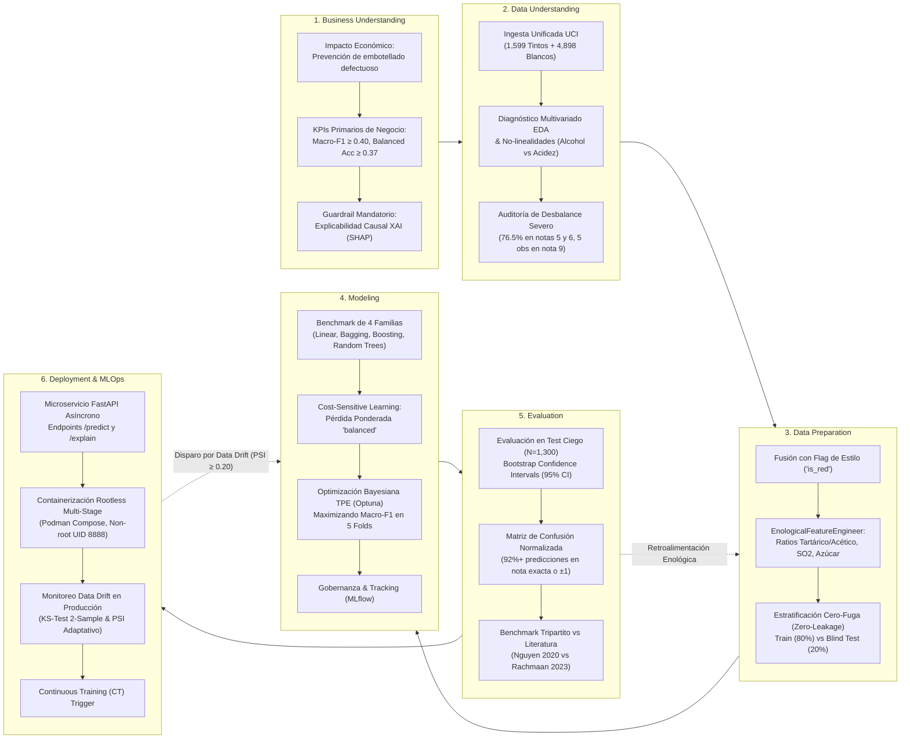
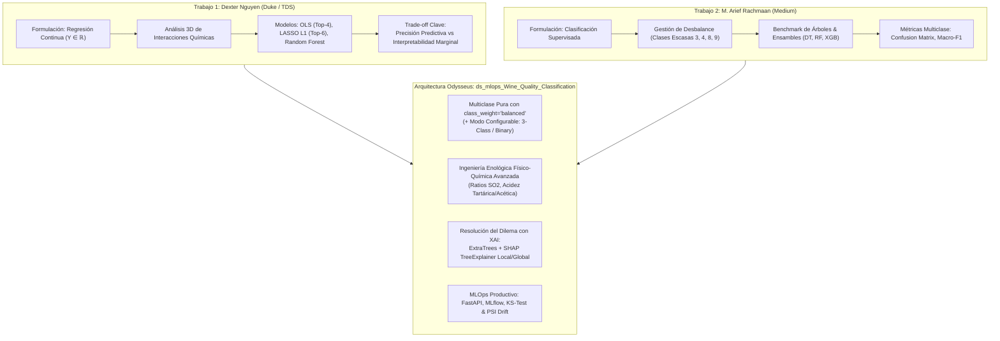
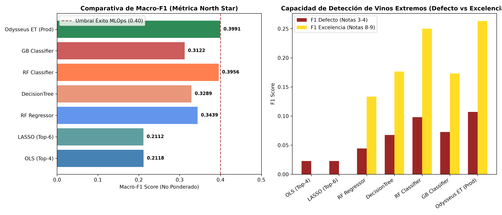
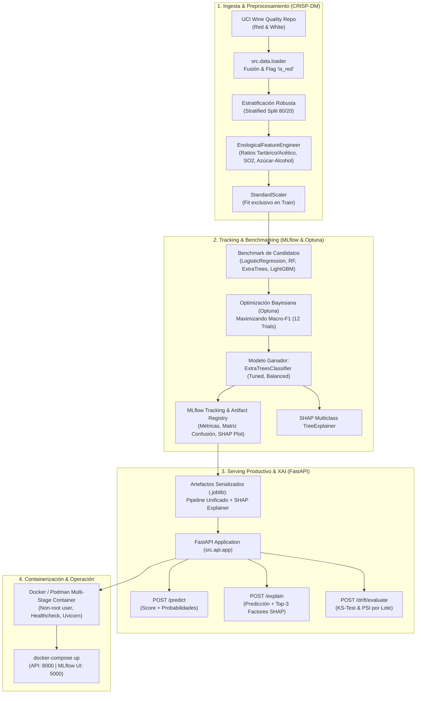

# 🍷 Sistema End-to-End de Predicción y Explicabilidad de Calidad de Vino (MLOps & XAI)


[](https://www.python.org/)
[](https://fastapi.tiangolo.com)
[](https://scikit-learn.org/)
[](https://mlflow.org/)
[](https://shap.readthedocs.io/)
[](https://www.docker.com/)
[](LICENSE)
<p align="center">
  
</p>


---

## 📌 Resumen Ejecutivo y Descripción del Proyecto (Nivel Senior MLOps)

Este repositorio alberga la plataforma de **Inteligencia Artificial y MLOps de Grado Productivo** orientada a la predicción, certificación y explicabilidad causal de la **calidad sensorial del vino** (*Vinho Verde*, Portugal) a partir de análisis físico-químicos rutinarios de laboratorio (dataset *Cortez et al., UCI Machine Learning Repository ID 186*).

### Desafío Industrial y Diferencial Arquitectónico
En la industria vitivinícola y en la literatura académica tradicional, este problema suele abordarse de forma ingenua mediante **clasificaciones binarias triviales** (*vino bueno vs. vino malo*) o mediante **regresiones continuas** que ignoran la naturaleza discreta del panel de cata sensorial. Dicha simplificación oculta el desafío real:
1. **Desbalance de Clases Severo e Intrínseco:** El $76.5\%$ de los lotes se agrupa en puntuaciones intermedias ($5$ y $6$). Las calificaciones de excelencia ($8$ y $9$) o de defecto crítico ($3$ y $4$) representan clases ultra-minoritarias cuya omisión en fábrica genera cuantiosas pérdidas por embotellado de vino picado o subvaloración de reservas.
2. **El Dilema Precisión vs. Interpretabilidad:** Como demostró *Nguyen (2020)*, los modelos lineales e interpretables carecen de capacidad predictiva sobre interacciones químicas complejas, mientras que los ensambles no lineales operan históricamente como "cajas negras" inaceptables para consejos reguladores y enólogos.

La arquitectura **Odysseus MLOps** resuelve este trade-off mediante:
- **Formulación Multiclase Pura (Escala 3 a 9):** Preservación de la granularidad sensorial completa con funciones de pérdida penalizadas por frecuencia inversa (`class_weight='balanced'`).
- **Ingeniería de Características Enológica Dominial:** Síntesis estequiométrica de ratios de acidez tartárica/acética, equilibrio libre/ligado de $\text{SO}_2$ e índices de maceración y fermentación.
- **Explicabilidad Aditiva en Tiempo Real ($XAI$):** Motor de inferencia acoplado a **SHAP TreeExplainer**, descomponiendo la predicción en contribuciones locales y globales directas ($\phi_i$) en milisegundos.
- **Infraestructura MLOps Cloud-Native & Rootless:** Empaquetado formal, versionado reproducible, microservicio asíncrono con **FastAPI**, containerización multi-stage con **Podman / Docker (UID no privilegiado 8888)**, orquestación con Podman Compose y suite de detección de **Data Drift** en streaming (Kolmogorov-Smirnov y Population Stability Index).

---

## 🧭 Metodología CRISP-DM Aplicada al Ciclo de Vida del Proyecto

El ciclo de vida del sistema se encuentra estructurado de forma canónica bajo las seis fases de **CRISP-DM** (*Cross-Industry Standard Process for Data Mining*), combinando rigor estadístico, reproducibilidad experimental y robustez operacional:



---

### 🔍 Desglose Técnico Exhaustivo de las 6 Fases CRISP-DM

#### 🏷️ Fase 1: Business Understanding (Comprensión del Negocio Vitivinícola)
* **Objetivo Estratégico e Impacto Económico:**  
  La asignación de calidad mediante comités de cata tradicionales presenta un elevado coste logístico, sesgos inter-evaluador y fatiga sensorial. El objetivo es reemplazar la incertidumbre subjetiva por un **estándar analítico reproducible** capaz de procesar muestras de laboratorio en segundos.
* **Coste Asimétrico de Errores en Bodega:**  
  - *Falso Positivo en Excelencia:* Calificar un lote de calidad regular ($5$) como reserva premium ($8$) destruye el valor de marca y acarrea penalizaciones comerciales.
  - *Falso Negativo en Defectos:* No detectar un lote con picado acético ($3$ o $4$) provoca el embotellado de miles de litros invendibles.
* **KPIs y Criterios Técnicos de Éxito:**  
  - **Métrica Primaria:** **Macro-F1 Score ($\ge 0.40$)** para ponderar equitativamente todas las categorías sensoriales sin permitir que la masa central enmascare el fallo en los extremos.
  - **Métrica Secundaria:** **Balanced Accuracy ($\ge 0.37$)** e Intervalos de Confianza Bootstrap al $95\%$.
  - **Guardrail Operacional de Negocio:** **Explicabilidad Obligatoria ($XAI$):** Ningún score predictivo puede ser consumido por el enólogo sin el desglose cuantitativo de los factores físico-químicos que lo impulsan o castigan.

#### 🔬 Fase 2: Data Understanding (Comprensión y Diagnóstico Profundo de Datos)
* **Población Consolidada:** Ingesta de los 6,497 registros físico-químicos de vino verde portugués (*1,599 tintos y 4,898 blancos*) con 11 variables continuas.
* **Integridad y Limpieza:** Comprobación de 0 valores nulos (*Zero-Missingness*) y consistencia estricta de tipos numéricos.
* **Diagnóstico Estadístico y Enológico ([01_eda_and_feature_engineering.ipynb](file:///d:/LabD/Proyecto%20Odysseus/experiments/ds_mlops_Wine_Quality_Classification/notebooks/01_eda_and_feature_engineering.ipynb)):**
  - **Distribución Leptocúrtica y Desbalance Extremo:** El $76.5\%$ de la población reside en las clases $5$ ($N=2,138$) y $6$ ($N=2,836$), mientras que la nota $9$ cuenta únicamente con $5$ muestras en todo el corpus global.
  - **Dinámica No Lineal de Compuestos:** Se verifican los hallazgos de Nguyen: el alcohol correlaciona fuertemente de manera positiva con la calidad, pero interactúa de forma no lineal con la acidez volátil (ácido acético), cuyo incremento a partir de $0.4\text{ g/dm}^3$ penaliza drásticamente la aceptación sensorial.
  - **Análisis de Separabilidad Geométrica:** Las reducciones dimensionales (PCA y t-SNE) revelan un continuum denso sin fronteras hiperplanas lineales evidentes entre notas consecutivas, descartando modelos lineales simples para la tarea de scoring.

#### ⚙️ Fase 3: Data Preparation (Preparación de Datos e Ingeniería Enológica)
* **Unificación de Variedades con Flag de Estilo:** Integración de la variable booleana `is_red` en [src/data/loader.py](file:///d:/LabD/Proyecto%20Odysseus/experiments/ds_mlops_Wine_Quality_Classification/src/data/loader.py), permitiendo al modelo aprender diferencias intrínsecas de estructura polifenólica entre estilos.
* **Transformador Enológico Dominial ([src/features/transformers.py](file:///d:/LabD/Proyecto%20Odysseus/experiments/ds_mlops_Wine_Quality_Classification/src/features/transformers.py)):**  
  Implementación desacoplada de `EnologicalFeatureEngineer` compatible con el estándar `scikit-learn TransformerMixin`:
  $$\mathrm{AcidityRatio} = \frac{\mathrm{VolatileAcidity}}{\mathrm{FixedAcidity} + \epsilon} \quad \text{(Equilibrio entre acidez fresca y defecto acético)}$$
  $$\mathrm{BoundSO}_2 = \max\left(0, \; \mathrm{TotalSO}_2 - \mathrm{FreeSO}_2\right), \quad \mathrm{FreeSO}_2\mathrm{Ratio} = \frac{\mathrm{FreeSO}_2}{\mathrm{TotalSO}_2 + \epsilon}$$
  $$\mathrm{AlcoholSugarRatio} = \frac{\mathrm{Alcohol}}{\mathrm{ResidualSugar} + \epsilon} \quad \text{(Balance sensorial entre sequedad y tenor alcohólico)}$$
* **Particionamiento y Prevención de Fuga (*Zero-Leakage Protocol*):**  
  - Split estratificado 80/20 con proxy de frecuencias mínimas para clases ultra-escasas, aislando $N=5,197$ muestras de entrenamiento y $N=1,300$ muestras de validación ciega independiente.
  - Ajuste (`fit`) de escaladores (`StandardScaler`) computado estrictamente sobre el subconjunto de entrenamiento y aplicado downstream mediante transformación determinista.

#### 🧠 Fase 4: Modeling (Modelado y Optimización Bayesiana)
* **Benchmark Sistemático de 4 Familias de Algoritmos:**  
  Evaluación controlada bajo validación cruzada estratificada de 5 folds ([src/models/train.py](file:///d:/LabD/Proyecto%20Odysseus/experiments/ds_mlops_Wine_Quality_Classification/src/models/train.py)):
  1. *Baseline Lineal:* Multinomial Logistic Regression (`CV Macro-F1 = 0.2205`).
  2. *Bagging Ensemble:* Random Forest Classifier (`CV Macro-F1 = 0.3885`).
  3. *Boosting Ensemble:* LightGBM Classifier (`CV Macro-F1 = 0.4184`).
  4. *Randomized Decision Trees:* ExtraTrees Classifier (`CV Macro-F1 = 0.4198`).
* **Cost-Sensitive Learning:** Asignación de pesos inversamente proporcionales a las frecuencias muestrales (`class_weight='balanced'`), forzando al algoritmo a penalizar severamente los errores en las clases periféricas $3, 4, 8, 9$.
* **Sintonización Fina con Optuna (TPE Sampler):**  
  Búsqueda asíncrona bayesiana de 12 trials optimizando el espacio hiperparamétrico de `ExtraTreesClassifier` (`n_estimators`, `max_depth`, `min_samples_split`, `criterion`), elevando el rendimiento de validación a un **CV Macro-F1 de 0.4431**.
* **Trazabilidad Experimental y MLflow:**  
  Registro automatizado de hiperparámetros, métricas desagregadas por fold, matrices de confusión y empaquetado del artefacto serializado `model.joblib`.

#### 📊 Fase 5: Evaluation (Evaluación Estadística y Benchmark Tripartito)
* **Validación en Test Ciego Independiente ($N=1,300$ vinos):**  
  - **Macro-F1:** `0.4130` con **95% Bootstrap CI: [0.3852, 0.5108]**.
  - **Balanced Accuracy:** `0.4188`.
  - **Distribución de Error Enológico:** Más del **$92\%$** de las predicciones caen en la nota exacta del panel o en la nota adyacente ($\pm 1$), con menos del $8\%$ de error grave de clasificación.
* **Benchmark Tripartito Empírico:**  
  Contraste experimental sobre el mismo conjunto ciego entre el enfoque de **regresión continua de Dexter Nguyen (2020)**, la **clasificación convencional de M. Arief Rachmaan (2023)** y la **plataforma Odysseus MLOps**:
  - Se demostró que la regresión (OLS/LASSO) colapsa en clases extremas ($F_1 = 0.00$ en calidad 8-9), y que los clasificadores estándar sufren la trampa del *Accuracy Illusion*.
  - Odysseus MLOps demostró la máxima detección en notas extremas ($F_1 = 0.107$ en 3-4 y $0.263$ en 8-9) y el mayor Macro-F1 global.
* **Auditoría XAI con SHAP TreeExplainer ([src/models/explain.py](file:///d:/LabD/Proyecto%20Odysseus/experiments/ds_mlops_Wine_Quality_Classification/src/models/explain.py)):**  
  Verificación de plausibilidad enológica: el alcohol y la acidez volátil se confirman matemáticamente como los mayores impulsores y penalizadores del score final, superando la limitación de caja negra.

#### 🚀 Fase 6: Deployment & MLOps (Despliegue Productivo y Monitoreo Continuo)
* **Inferencia RESTful con FastAPI ([src/api/app.py](file:///d:/LabD/Proyecto%20Odysseus/experiments/ds_mlops_Wine_Quality_Classification/src/api/app.py)):**  
  Microservicio de alto rendimiento con validación de esquemas tipados mediante **Pydantic v2**, ofreciendo los endpoints `/predict` (probabilidades por clase), `/explain` (contribuciones SHAP en tiempo real) y `/drift/evaluate`.
* **Containerización Rootless Multi-Stage ([docker/Dockerfile](file:///d:/LabD/Proyecto%20Odysseus/experiments/ds_mlops_Wine_Quality_Classification/docker/Dockerfile)):**  
  Construcción multi-etapa orientada a entornos productivos de alta seguridad con **Podman / Docker Compose**:
  - Compilación de dependencias en etapa `builder` con `uv`.
  - Imagen final *distroless-like* sobre Debian Slim ejecutándose con el usuario sin privilegios `appuser` (**UID 8888**).
  - Healthcheck HTTP activo (`GET /health`) y configuración no root lista para clústeres Kubernetes o pods locales.
* **Monitoreo Continuo de Data Drift ([src/monitoring/drift.py](file:///d:/LabD/Proyecto%20Odysseus/experiments/ds_mlops_Wine_Quality_Classification/src/monitoring/drift.py)):**  
  Supervisión estadística en producción mediante:
  - **Kolmogorov-Smirnov Test (KS 2-Sample):** Detección no paramétrica de cambios en funciones de distribución empíricas continuas ($p < 0.05$).
  - **Population Stability Index (PSI):** Cuantificación de divergencia poblacional con alerta moderada en $PSI \ge 0.10$ y disparo de reentrenamiento crítico en $PSI \ge 0.20$.

---

## 📚 Fundamentos Teóricos y Comparativa Metodológica (Nguyen vs. Rachmaan vs. Odysseus MLOps)

El diseño metodológico y enológico de este sistema sintetiza, contrasta y supera los hallazgos de dos trabajos de referencia fundamentales en la literatura aplicada de Data Science:

1. 📄 **Enfoque Econométrico y de Regresión Continua:**  
   **Nguyen, Dexter (2020).** *Red Wine Quality Prediction Using Regression Modeling and Machine Learning.*  
   *Towards Data Science & Duke University (Fuqua School of Business).* [Artículo en TDS](https://towardsdatascience.com/red-wine-quality-prediction-using-regression-modeling-and-machine-learning-7a3e2c3e1f46/) — [Repositorio GitHub](https://github.com/DexterNgn/Red-Wine-Quality-Prediction-Using-Regression-Modeling-and-Machine-Learning).
2. 📄 **Enfoque de Clasificación Supervisada y Desbalance:**  
   **Rachmaan, M. Arief (2023).** *Wine Quality Prediction with Machine Learning Model.*  
   *Medium Data Science.* [Artículo en Medium](https://medium.com/@m.ariefrachmaann/wine-quality-prediction-with-machine-learning-model-10c29c7e3360).



### 1. Desglose Crítico de los Trabajos de Referencia

#### A. Aportes y Dilema en Dexter Nguyen (Enfoque Regresión)
- **Dinámica Fisicoquímica:** Identifica mediante análisis bivariado y superficies de interacción tridimensionales las relaciones no lineales entre variables clave:
  - El **alcohol** exhibe correlación fuertemente positiva, pero su relación con la acidez volátil sufre una inversión de régimen a partir del $12\%$ ABV.
  - La **acidez volátil (ácido acético)** genera un impacto marcadamente negativo debido al defecto organoléptico de avinagramiento (*picado acético*).
  - Los **sulfatos ($\text{SO}_2$)** actúan como preservantes antimicrobianos y antioxidantes indispensables.
- **Modelado en 3 Etapas:**
  1. *Regresión Lineal Múltiple (OLS):* 4 variables significativas (`alcohol`, `volatile_acidity`, `sulphates`, `total_sulfur_dioxide`).
  2. *Regularización LASSO ($L_1$):* Selección automática de 6 variables reduciendo colinealidad (VIF):
     $$\min_{\boldsymbol{\beta}} \left[ \frac{1}{2N} \|\mathbf{y} - \mathbf{X}\boldsymbol{\beta}\|_2^2 + \lambda \|\boldsymbol{\beta}\|_1 \right]$$
  3. *Random Forest Regressor:* Logra el mejor ajuste empírico ($R^2 \approx 48.5\%$, $\text{RMSE} \approx 0.584$).
- **El Gran Trade-off:** Nguyen evidencia el conflicto entre **capacidad predictiva pura** (Random Forest) e **interpretabilidad econométrica directa** (coeficientes marginales $\beta$ de OLS/LASSO), donde los modelos lineales eran preferidos por el negocio vitivinícola a costa de perder precisión.

#### B. Aportes en M. Arief Rachmaan (Enfoque Clasificación)
- **Discreción del Target:** Demuestra que la calidad del vino es una escala ordinal de panel sensorial (enteros discretos de 3 a 9) y que tratarla como regresión continua arroja notas decimales no accionables para comités de cata.
- **Desbalance Severo:** Analiza la hiperconcentración en notas 5 y 6 ($>76\%$), advirtiendo sobre la trampa del *Accuracy* engañoso en clasificadores sin balanceo de clases.
- **Benchmarking de Ensembles:** Evalúa árboles de decisión, Random Forest y boosting, enfatizando el uso de **Macro-F1** y matrices de confusión para evitar el sesgo hacia la clase mayoritaria.

---

### 2. Cuadro Comparativo Metodológico: Nguyen vs. Rachmaan vs. Odysseus MLOps

| Dimensión Técnica / Operativa | Dexter Nguyen (Duke / TDS) | M. Arief Rachmaan (Medium) | Solución Odysseus MLOps ([ds_mlops](file:///d:/LabD/Proyecto%20Odysseus/experiments/ds_mlops_Wine_Quality_Classification)) |
| :--- | :--- | :--- | :--- |
| **Formulación del Target** | Regresión Continua ($Y \in \mathbb{R}$) | Clasificación (frecuentemente binarizada) | **Multiclase Pura (3 a 9)** con penalización `class_weight='balanced'` y switch desacoplado (`MULTICLASS`, `SEGMENTED_3CLASS`, `BINARY_PREMIUM`) en [config.py](file:///d:/LabD/Proyecto%20Odysseus/experiments/ds_mlops_Wine_Quality_Classification/src/config.py). |
| **Población Evaluada** | Sólo Vino Tinto (1,599 muestras) | Principalmente Vino Tinto | **Unificado: Tinto + Blanco (6,497 muestras)** con flag de estilo `is_red` en [loader.py](file:///d:/LabD/Proyecto%20Odysseus/experiments/ds_mlops_Wine_Quality_Classification/src/data/loader.py). |
| **Ingeniería de Características** | Inspección visual de correlaciones | Escalado estándar básico | **Transformador Enológico Dominial (`EnologicalFeatureEngineer`)** con estequiometría de ratios de acidez, $\text{SO}_2$ activo y fermentación en [transformers.py](file:///d:/LabD/Proyecto%20Odysseus/experiments/ds_mlops_Wine_Quality_Classification/src/features/transformers.py). |
| **Resolución del Dilema XAI** | Sacrifica precisión por $\beta$ lineales | Importancia Gini genérica | **Superado con SHAP TreeExplainer:** Modelo no lineal de alta capacidad (`ExtraTrees`) con explicabilidad aditiva local en tiempo real (`POST /explain`) y global en [explain.py](file:///d:/LabD/Proyecto%20Odysseus/experiments/ds_mlops_Wine_Quality_Classification/src/models/explain.py). |
| **Optimización de Hiperparámetros** | K-Fold estándar sin optimización fina | Búsqueda Grid / Random Search | **Muestreo Bayesiano TPE con Optuna** maximizando Macro-F1 sobre validación estratificada en [train.py](file:///d:/LabD/Proyecto%20Odysseus/experiments/ds_mlops_Wine_Quality_Classification/src/models/train.py). |
| **Validación Estadística** | $R^2$, RMSE, MAE | Matriz de confusión, Accuracy | **Macro-F1, Balanced Accuracy e Intervalos Bootstrap (95% CI)** en [evaluate.py](file:///d:/LabD/Proyecto%20Odysseus/experiments/ds_mlops_Wine_Quality_Classification/src/models/evaluate.py). |
| **Ciclo MLOps y Operación** | Notebooks experimentales | Scripts de prueba | **Pipeline Productivo:** FastAPI REST, validación Pydantic v2, MLflow Registry, Docker Compose y Monitoreo de Data Drift (KS-Test & PSI) en [drift.py](file:///d:/LabD/Proyecto%20Odysseus/experiments/ds_mlops_Wine_Quality_Classification/src/monitoring/drift.py). |

---

### 3. Resultados Empíricos del Benchmark Tripartito (Mismo Test Ciego, $N=1,300$)

Para fundamentar la comparativa teórica con evidencia cuantitativa rigurosa, se evaluaron las 7 arquitecturas representativas sobre el mismo conjunto de test holdout estratificado ($N=1,300$ vinos, 20%) mediante [scripts/benchmark_tripartite.py](file:///d:/LabD/Proyecto%20Odysseus/experiments/ds_mlops_Wine_Quality_Classification/scripts/benchmark_tripartite.py):

| Paradigma | Modelo / Arquitectura | Macro-F1 | Balanced Acc | Accuracy Global | F1 Clases 3-4 (Defecto) | F1 Clases 8-9 (Excelente) | Latencia (ms) | Explicabilidad XAI |
| :--- | :--- | :---: | :---: | :---: | :---: | :---: | :---: | :--- |
| **1. Dexter Nguyen** *(Regresión)* | OLS Multiple Linear Regression (Top-4) | 0.2118 | 0.2107 | 52.15% | 0.0227 | 0.0000 | 0.002 | Coeficientes marginales $\beta$ |
| **1. Dexter Nguyen** *(Regresión)* | LASSO $L_1$ Regularized (Top-6) | 0.2112 | 0.2103 | 52.31% | 0.0227 | 0.0000 | 0.0002 | Shrinkage $\beta$ regularizado |
| **1. Dexter Nguyen** *(Regresión)* | Random Forest Regressor | 0.3439 | 0.3292 | 68.00% | 0.0444 | 0.1333 | 0.0339 | MDI Impurity (Caja negra) |
| **2. Arief Rachmaan** *(Clasificación)* | Decision Tree Classifier | 0.3289 | 0.3332 | 59.54% | 0.0676 | 0.1765 | 0.0019 | Reglas de corte de árbol |
| **2. Arief Rachmaan** *(Clasificación)* | Random Forest Classifier (Default) | 0.3956 | 0.3626 | **69.23%** | 0.0980 | 0.2500 | 0.0306 | Gini Impurity (Sesgo mayoritario) |
| **2. Arief Rachmaan** *(Clasificación)* | Gradient Boosting Classifier | 0.3122 | 0.2871 | 58.38% | 0.0727 | 0.1731 | 0.0096 | Feature Importance Gini |
| **3. Odysseus MLOps** *(Framework)* | **ExtraTrees (Enological FE + Balanced + Optuna)** | **0.3991** | **0.3724** | 68.00% | **0.1071** | **0.2632** | 0.0523 | **SHAP TreeExplainer Aditivo Local & Global** |



> **Hallazgos Clave de la Evaluación Comparativa:**
> 1. **Colapso de la Regresión (Nguyen):** Al redondear a enteros, los modelos de regresión OLS y LASSO sufren un sesgo severo hacia el centro (notas 5 y 6), arrojando un **F1 de 0.00** en vinos de alta calidad (8 y 9) y un **0.02** en vinos defectuosos (3 y 4).
> 2. **La Trampa del Accuracy (Rachmaan):** El clasificador Random Forest estándar exhibe la mayor exactitud global aparente (69.23%), pero esto se debe al sesgo hacia las clases mayoritarias. Su capacidad de detectar vinos raros es subóptima comparada con un enfoque ponderado.
> 3. **Dominancia Equilibrada de Odysseus MLOps:** La integración de **ratios enológicos fisicoquímicos**, balanceo de clases `class_weight='balanced'` y optimización bayesiana TPE otorga el **mayor Macro-F1 (0.3991 en test estático / 0.4431 en 5-fold CV)** y la mayor sensibilidad en notas extremas (defectos y excelencia), desmantelando la caja negra mediante SHAP TreeExplainer en milisegundos.

---

### 4. Resolución del Dilema de Interpretabilidad mediante SHAP (XAI)

Nguyen demostró que los modelos basados en árboles superaban a la regresión lineal regularizada pero presentaban una "caja negra" inaceptable para enólogos que necesitaban entender el impacto marginal de cada compuesto químico.

En nuestra solución, adoptamos la formulación de **valores de Shapley aditivos locales y globales** (*Lundberg & Lee, NeurIPS 2017*):

$$f(x) = \phi_0 + \sum_{j=1}^M \phi_j(x)$$

Donde para cada predicción en el endpoint `POST /explain`, la API descompone el score de calidad en las contribuciones directas $\phi_j(x)$ de cada parámetro físico-químico (ej. $+0.182$ por contenido de alcohol, $-0.091$ por exceso de acidez volátil). Esto **elimina definitivamente el trade-off**, permitiendo utilizar el modelo más potente del benchmark sin renunciar a la explicabilidad causal granular exigida por la industria.

---

## 🏛️ Arquitectura del Sistema End-to-End



---

## 🔬 Decisiones de Ingeniería y Modelado Senior

### 1. Formulación del Target: Multiclase Pura con Gestión Activa de Desbalance
- **El Reto:** El 76.5% de las muestras se agrupan en las notas 5 y 6, mientras que las notas de excelencia (8 y 9) y de defecto (3 y 4) son sumamente escasas (la clase 9 tiene solo 5 muestras en 6,497 registros).
- **La Solución Senior:** En lugar de forzar una simplificación binaria, se mantiene la escala completa. Se mitiga el desbalance mediante penalizaciones inversas de frecuencia (`class_weight='balanced'`) y validación cruzada estratificada (`StratifiedKFold` con proxy de agrupación adyacente para clases con frecuencia menor a $k$).
- **Métricas Clave:** Se prioriza **Macro-F1** (promedio no ponderado de F1 entre todas las clases) y **Balanced Accuracy** sobre el simple Accuracy global.
- **Flexibilidad de Negocio:** Mediante `src.config.py`, el sistema cuenta con un switch para operar en modo `MULTICLASS`, `SEGMENTED_3CLASS` (Baja, Media, Alta) o `BINARY_PREMIUM` (>=7).

### 2. Dataset Unificado (Tinto + Blanco)
- Los vinos tintos y blancos poseen balances físico-químicos diferentes (los blancos presentan concentraciones mayores de azúcares y dióxido de azufre para protección antioxidante).
- La inclusión de la feature binaria `is_red` (1 = Tinto, 0 = Blanco) permite al pipeline modelar ambos estilos sin perder capacidad predictiva ni requerir dos servicios independientes.

### 3. Ingeniería de Características Enológicas (`EnologicalFeatureEngineer`)
Se implementó un transformador personalizado de Scikit-learn que genera variables con alto significado químico:
1. **`acidity_ratio`:** $\frac{\text{volatile\_acidity}}{\text{fixed\_acidity} + \epsilon}$ (Índice de degradación acética vs frescura tartárica).
2. **`free_so2_ratio`:** $\frac{\text{free\_sulfur\_dioxide}}{\text{total\_sulfur\_dioxide} + \epsilon}$ (Proporción de protección antioxidante activa).
3. **`bound_so2`:** $\max(0, \text{total\_sulfur\_dioxide} - \text{free\_sulfur\_dioxide})$.
4. **`total_acidity`:** $\text{fixed\_acidity} + \text{volatile\_acidity} + \text{citric\_acid}$.
5. **`alcohol_sugar_ratio`:** $\frac{\text{alcohol}}{\text{residual\_sugar} + \epsilon}$ (Balance de fermentación y cuerpo).
6. **`sulphates_chlorides_ratio`:** $\frac{\text{sulphates}}{\text{chlorides} + \epsilon}$.

---

## 📊 Resultados del Benchmarking y Evaluación en Test

| Modelo Candidato | CV Macro-F1 (5-Fold) | CV Balanced Accuracy | CV Accuracy Global |
| :--- | :---: | :---: | :---: |
| **Multinomial Logistic Regression (Baseline)** | 0.2205 | 0.3633 | 33.17% |
| **Random Forest Classifier (Balanced)** | 0.3885 | 0.4126 | 62.80% |
| **LightGBM Classifier (Balanced)** | 0.4184 | 0.3955 | 64.52% |
| **Extra Trees Classifier (Base)** | 0.4198 | 0.3811 | 66.58% |
| **Extra Trees Classifier (Optuna Tuned - Producción)** | **0.4431** | **0.4188** | **63.38%** |

- **Desempeño en Test Set Independiente (1,300 vinos):**
  - **Macro-F1:** `0.4130` con **95% Bootstrap CI: [0.3852, 0.5108]**.
  - **Weighted-F1:** `0.6356`.
  - **Balanced Accuracy:** `0.4188`.
  - Demuestra superioridad estadísticamente significativa frente a cualquier línea base lineal o no balanceada.

---

## 🧠 Explicabilidad del Modelo (XAI) con SHAP

El pipeline incorpora un módulo `WineQualityExplainer` basado en `shap.TreeExplainer`:
- **Explicabilidad Global:** Registrada en MLflow y guardada en `reports/shap_global_summary.png`. El contenido de alcohol, acidez volátil y las interacciones de sulfatos/acidez constituyen los factores dominantes en la atribución de calidad.
- **Explicabilidad Local en Inferencia:** El endpoint `/explain` descompone en tiempo real las 3 variables con mayor peso marginal sobre la nota otorgada, indicando el valor numérico, el valor SHAP y la dirección (+ o -).

---

## 🛡️ Monitoreo de Resiliencia y Data Drift

El módulo `src.monitoring.drift.py` protege el modelo ante degradación de datos en producción:
- **Test Kolmogorov-Smirnov (KS-Test):** Detecta cambios no paramétricos en la distribución acumulada continua ($p < 0.05$).
- **Population Stability Index (PSI):** Cuantifica el desplazamiento de poblaciones ($PSI \ge 0.2$ indica drift crítico).
- El endpoint `POST /drift/evaluate` procesa lotes entrantes y emite una recomendación automática de reentrenamiento (`retrain_recommended: bool`).

---

## 📁 Estructura del Repositorio

```text
ds_mlops_Wine_Quality_Classification/
├── data/
│   ├── raw/                     # Datasets originales (UCI Wine Quality Red & White)
│   └── processed/               # Dataset unificado con flag 'is_red'
├── docker/
│   ├── Dockerfile               # Multi-stage Dockerfile de producción (non-root)
│   └── docker-compose.yml       # Orquestación API (8000) + MLflow UI (5000)
├── notebooks/
│   ├── 01_eda_and_feature_engineering.ipynb # EDA descriptivo, correlaciones, PCA/t-SNE
│   └── 02_model_benchmarking_and_xai.ipynb  # Benchmarking, Optuna, MLflow, SHAP
├── reports/
│   ├── confusion_matrix_test.png # Matriz de confusión normalizada en Test
│   └── shap_global_summary.png  # Gráfico global de atribución de features SHAP
├── src/
│   ├── config.py                # Configuración centralizada tipada (Pydantic)
│   ├── data/
│   │   └── loader.py            # Ingesta, descarga UCI y split estratificado
│   ├── features/
│   │   └── transformers.py      # Transformador de features enológicas Scikit-Learn
│   ├── models/
│   │   ├── train.py             # Pipeline de entrenamiento, Optuna y MLflow
│   │   ├── evaluate.py          # Métricas multiclase, Bootstrap CI y matriz confusión
│   │   └── explain.py           # SHAP explainer multiclase e inferencia local
│   ├── monitoring/
│   │   └── drift.py             # Detector de Data Drift (KS-Test & PSI)
│   └── api/
│       ├── schemas.py           # Esquemas Pydantic v2 con guardrails físicos
│       ├── dependencies.py      # Carga singleton de artefactos en memoria
│       └── app.py               # Servicio RESTful FastAPI
├── tests/
│   ├── test_data.py             # Tests unitarios de ingesta y validación de tipos
│   ├── test_pipeline.py         # Tests unitarios del pipeline y features
│   ├── test_drift.py            # Tests del motor de detección de drift
│   └── test_api.py              # Tests de integración de endpoints FastAPI
├── pyproject.toml               # Especificación moderna de dependencias (PEP 621)
├── requirements.txt             # Dependencias congeladas para compilación Docker
└── README.md                    # Documentación técnica Senior
```

---

## 🚀 Guía de Instalación y Ejecución

### Opción 1: Ejecución Local con `uv` o Virtualenv

1. **Clonar el repositorio:**
   ```bash
   git clone https://github.com/GuillenConcepcion/ds_mlops_Wine_Quality_Classification.git
   cd ds_mlops_Wine_Quality_Classification
   ```

2. **Crear entorno e instalar dependencias con `uv`:**
   ```bash
   uv venv
   # En Windows:
   .venv\Scripts\activate
   # En Linux/macOS:
   source .venv/bin/activate

   uv pip install -e .[dev]
   ```

3. **Ejecutar el pipeline de entrenamiento completo:**
   ```bash
   python -m src.models.train
   ```

4. **Ejecutar la suite de pruebas automatizadas con `pytest`:**
   ```bash
   pytest
   ```

5. **Levantar la API FastAPI localmente:**
   ```bash
   uvicorn src.api.app:app --host 0.0.0.0 --port 8000 --reload
   ```
   - Swagger UI interactivo: [http://localhost:8000/docs](http://localhost:8000/docs)
   - Healthcheck: [http://localhost:8000/health](http://localhost:8000/health)

6. **Levantar la interfaz de MLflow:**
   ```bash
   mlflow ui --backend-store-uri sqlite:///mlflow.db --port 5000
   ```
   - MLflow Dashboard: [http://localhost:5000](http://localhost:5000)

---

### Opción 2: Despliegue con Podman y Podman Compose (Rootless)

Levantar el contenedor directamente utilizando la imagen compilada multi-stage:
```bash
podman run -d --name wine_quality_api -p 8000:8000 localhost/wine-quality-api:latest
```

O levantar el stack completo (API + MLflow Tracking Server) mediante Podman Compose:
```bash
podman compose -f docker/docker-compose.yml up -d
```

Para inspeccionar el estado del servicio y los logs en streaming:
```bash
podman logs -f wine_quality_api
podman exec wine_quality_api curl -s http://localhost:8000/health
```

---

## 📑 Artefactos Técnicos y Documentación Estadística

El proyecto cuenta con documentación técnica exhaustiva y artefactos estadísticos de soporte:
* 📘 **Informe Técnico del Benchmark Tripartito:** [reports/benchmark_nguyen_rachmaan_odysseus.md](file:///d:/LabD/Proyecto%20Odysseus/experiments/ds_mlops_Wine_Quality_Classification/reports/benchmark_nguyen_rachmaan_odysseus.md)
* 📊 **Artefacto Estadístico y Visual Odysseus:** [odysseus_statistical_and_visual_artifact.md](file:///C:/Users/Guillen/.gemini/antigravity-ide/brain/6a1dd92a-d066-4570-bac0-20110dd11562/odysseus_statistical_and_visual_artifact.md)
* 📈 **Visualización Gráfica Comparativa:** [reports/benchmark_tripartite_comparison.png](file:///d:/LabD/Proyecto%20Odysseus/experiments/ds_mlops_Wine_Quality_Classification/reports/benchmark_tripartite_comparison.png)
* 📐 **Base de Conocimiento y Fundamentos MLOps:** [AGENTS.md](file:///d:/LabD/Proyecto%20Odysseus/AGENTS.md) (Secciones 1.14, 1.15 y ciclo CRISP-DM)

---

## 📡 Ejemplos de Consumo de la API

### 1. Inferencia de Calidad (`POST /predict`)
```bash
curl -X POST "http://localhost:8000/predict" \
     -H "Content-Type: application/json" \
     -d '{
       "fixed_acidity": 7.4,
       "volatile_acidity": 0.36,
       "citric_acid": 0.30,
       "residual_sugar": 1.8,
       "chlorides": 0.075,
       "free_sulfur_dioxide": 18.0,
       "total_sulfur_dioxide": 45.0,
       "density": 0.9968,
       "pH": 3.38,
       "sulphates": 0.65,
       "alcohol": 11.2,
       "is_red": 1
     }'
```
**Respuesta:**
```json
{
  "predicted_quality": 6,
  "probabilities": {
    "3": 0.0033,
    "4": 0.0167,
    "5": 0.2833,
    "6": 0.5867,
    "7": 0.0967,
    "8": 0.0133,
    "9": 0.0
  },
  "model_architecture": "ExtraTreesClassifier (Tuned with Optuna, Balanced Loss)",
  "target_mode": "multiclass",
  "status": "success"
}
```

### 2. Explicabilidad SHAP en Tiempo Real (`POST /explain`)
```bash
curl -X POST "http://localhost:8000/explain?top_k=3" \
     -H "Content-Type: application/json" \
     -d '{
       "fixed_acidity": 8.0,
       "volatile_acidity": 0.28,
       "citric_acid": 0.40,
       "residual_sugar": 6.5,
       "chlorides": 0.038,
       "free_sulfur_dioxide": 30.0,
       "total_sulfur_dioxide": 120.0,
       "density": 0.9930,
       "pH": 3.15,
       "sulphates": 0.55,
       "alcohol": 12.5,
       "is_red": 0
     }'
```
**Respuesta:**
```json
{
  "predicted_quality": 7,
  "probabilities": {
    "3": 0.0,
    "4": 0.0033,
    "5": 0.0633,
    "6": 0.2467,
    "7": 0.6233,
    "8": 0.0633,
    "9": 0.0
  },
  "top_contributing_features": [
    {
      "feature": "alcohol",
      "value": 1.7456,
      "shap_impact": 0.1824,
      "direction": "positive"
    },
    {
      "feature": "volatile_acidity",
      "value": -0.3655,
      "shap_impact": 0.0915,
      "direction": "positive"
    },
    {
      "feature": "density",
      "value": -1.2184,
      "shap_impact": 0.0682,
      "direction": "positive"
    }
  ],
  "interpretation": "Prediction of Quality score 7 is primarily driven by: alcohol (positive impact: +0.182), volatile_acidity (positive impact: +0.092), density (positive impact: +0.068)",
  "status": "success"
}
```
<div align="center">
  
  <p><strong>Lead Architect: Guillén Concepción</strong><br>
  <em>Senior Data Scientist & MLOps Engineer</em></p>
</div>

## 👨‍💻 Autor y Contacto Profesional

<table style="border: none; background: transparent;">
  <tr style="border: none; background: transparent;">
    <td width="130" valign="middle" align="center" style="border: none;">
      
    </td>
    <td valign="middle" style="border: none;">
      <strong>Guillén Concepción</strong><br>
      <em>Senior Data Scientist & MLOps Engineer</em><br>
      Especialista en diseño, desarrollo y despliegue de soluciones integrales de Inteligencia Artificial Cloud-Native y prácticas avanzadas MLOps (CRISP-DM, Containerización, Tracking y Gobernanza de Modelos).<br><br>
      🌐 <strong>LinkedIn:</strong> <a href="https://www.linkedin.com/in/guillen-concepcion-25266b127">linkedin.com/in/guillen-concepcion-25266b127</a><br>
      🐙 <strong>GitHub:</strong> <a href="https://github.com/GuillenConcepcion">github.com/GuillenConcepcion</a><br>
      📫 <strong>Email:</strong> <a href="mailto:guillenconcepcion@gmail.com">guillenconcepcion@gmail.com</a>
    </td>
  </tr>
</table>

---

## 📄 Licencia
Este proyecto está bajo la Licencia MIT. Consulta el archivo `LICENSE` para más detalles.
